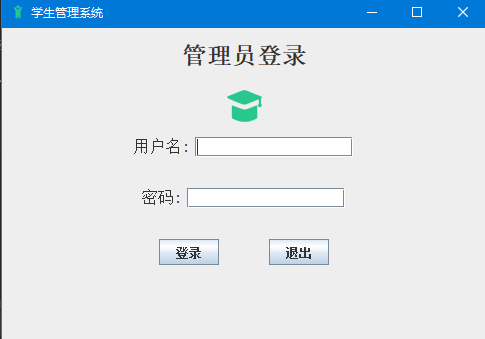
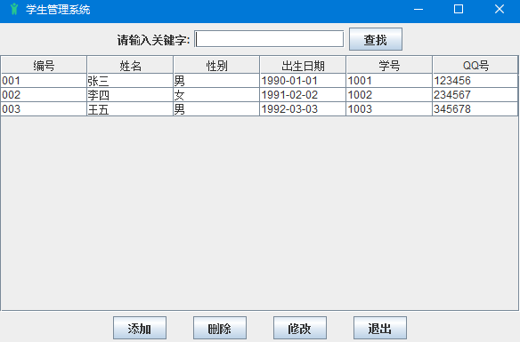
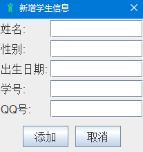
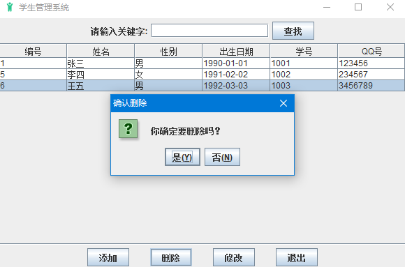
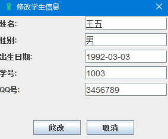
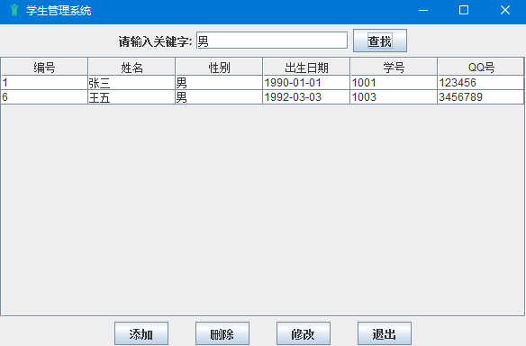

# stu_manage
gpt开发的学生管理系统，代码基本上用gpt生成，版本v2.0,用到了数据库，
使用方法：执行stu.sql的数据库文件后，在util包下的DBUtil中改成自己MySQL的用户名和密码，
在AdminLoginGUI中运行main函数，默认账号lzpnb,密码666，或者账号admin,密码admin。

界面展示如下：

登陆界面：

主界面：

增加：

删除：

修改：

查询：

